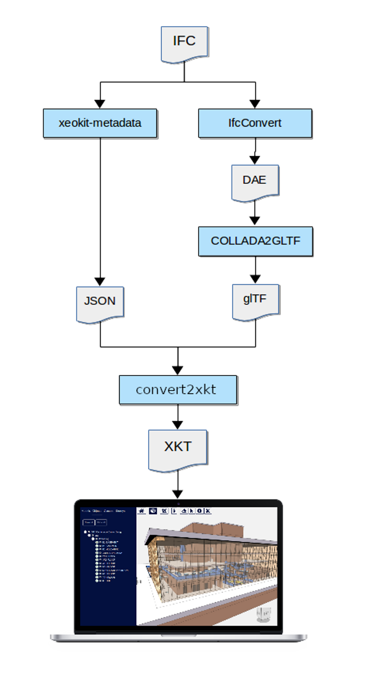

# bim-tools
Tools for BIM models

# Building dependencies:
    * Install Node.js (https://nodejs.org/en/download/)
    * .NET 7.0 Runtime (https://dotnet.microsoft.com/pt-br/download/dotnet/thank-you/runtime-7.0.2-windows-x64-installer?cid=getdotnetcore)
    * xeokit/xeokit-convert (https://github.com/xeokit/xeokit-convert)
        - npm i @xeokit/xeokit-convert
    * ifcConvert (https://github.com/IfcOpenShell/IfcOpenShell)
    * COLLADA2GLTF (https://github.com/KhronosGroup/COLLADA2GLTF)
    * xeokit-metadata (https://github.com/bimspot/xeokit-metadata)

# Importing from Sesam:
    * `import structure.ifcsesam`
    * `model = structure.ifcsesam.modelIfcSesam(xmlSesamFile=sesamFilePath)`

# Exporting to IFC
    * `model.ExportToIFC(outIfcFilePath)`
    

# Converting IFC --> XKT:
    * from IfcToXkt import ConvIfcToXkt
    * ConvIfcToXkt(ifcFile)
    * Building Requirements
        - [ifcConvert](http://ifcopenshell.org/ifcconvert) (v0.6.0 or later) to convert IFC files to DAE
        - [COLLADA2GLTF](https://github.com/KhronosGroup/COLLADA2GLTF) to convert DAE to glTF
        - [xeokit-metadata](https://github.com/bimspot/xeokit-metadata) to extract the JSON metadata from the IFC
        - [xeokit/xeokit-convert](https://xeokit.github.io/xeokit-convert/docs/) (convert2xkt) to convert glTF and JSON metadata into XKT

